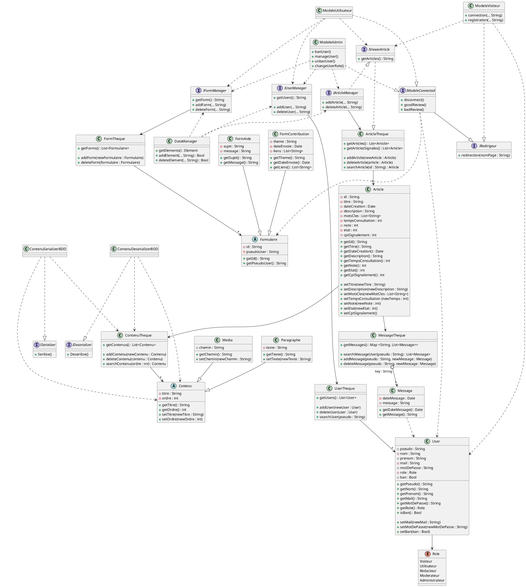

# Diagramme de classe

```plantuml
@startuml

class ContenuTheque{
    + getContenus() : List<Contenu>

    + addContenu(newContenu : Contenu)
    + deleteContenu(contenu : Contenu)
    + searchContenu(ordre : int) : Contenu
}

abstract class Contenu{
    - titre : String
    - ordre : int
    
    + getTitre() : String
    + getOrdre() : int
    + setTitre(newTitre : String)
    + setOrdre(newOrdre : int)
}

class Media{
    - chemin : String

    + getChemin() : String
    + setChemin(newChemin : String)
}

class Paragraphe{
    - texte : String

    + getTexte() : String
    + setTexte(newTexte : String)
}

class Article{
    - id : String
    - titre : String
    - dateCreation : Date
    - description : String
    - motsCles : List<String>
    - tempsConsultation : int
    - note : int
    - etat : int
    - cptSignalement : int

    + getId() : String
    + getTitre() : String
    + getDateCreation() : Date
    + getDescription() : String
    + getTempsConsultation() : int
    + getNote() : int
    + getEtat() : int
    + getCptSignalement() : int

    + setTitre(newTitre : String)
    + setDescription(newDescription : String)
    + setMotsCles(newMotCles : List<String>)
    + setTempsConsultation (newTemps : int)
    + setNote(newNote : int)
    + setEtat(newEtat : int)
    + setCptSignalement()
}

class ArticleTheque{
    + getArticles() : List<Article>
    + getArticlesSignales() : List<Article>

    + addArticle(newArticle : Article)
    + deleteArticle(article : Article)
    + searchArticle(id : String) : Article
}

class MessageTheque{
    + getMessages() : Map <String, List<Message>>

    + searchMessageUser(pseudo : String) : List<Message>
    + addMessage(pseudo : String, newMessage : Message)
    + deleteMessage(pseudo : String, newMessage : Message)
}

class Message{
    - dateMessage : Date
    - message : String

    + getDateMessage() : Date
    + getMessage() : String
}

class User{
    - pseudo : String
    - nom : String
    - prenom : String
    - mail : String
    - motDePasse : String
    - role : Role
    - ban : Bool

    + getPseudo() : String
    + getNom() : String
    + getPrenom() : String
    + getMail() : String
    + getMotDePasse() : String
    + getRole() : Role
    + isBan() : Bool
    
    + setMail(newMail : String)
    + setMotDePasse(newMotDePasse : String)
    + setBan(ban : Bool)
}

class UserTheque{
    + getUsers() : List<User>

    + addUser(newUser : User)
    + deleteUser(user : User)
    + searchUser(pseudo : String)
}

enum Role{
    Visiteur
    Utilisateur
    Redacteur
    Moderateur
    Administrateur
}

class FormTheque{
    + getForms() : List<Formulaire>
    
    + addForm(newFormulaire : Formulaire)
    + deleteForm(formulaire : Formulaire)
}

abstract Formulaire{
    - id : String
    - pseudoUser : String

    + getId() : String
    + getPseudoUser() : String
}

class FormAide{
    - sujet : String
    - message : String

    + getSujet() : String
    + getMessage() : String
}

class FormContribution{
    - theme : String
    - dateEnvoie : Date
    - liens : List<String> 

    + getTheme() : String
    + getDateEnvoie() : Date
    + getLiens() : List<String>
}

interface IRedirigeur{
    + redirection(nomPage : String)
}

class ModeleVisiteur{
    + connection(... String)
    + registration(... String)
}

interface IModeleConnected {
    + disconnect()
    + goodReview()
    + badReview()
}

class ModeleUtilisateur{
}

class ModeleAdmin{
    + banUser()
    + manageUser()
    + unbanUser()
    + changeUserRole()
}

interface IFormManager{
    + getForm() : String
    + addForm(... String)
    + deleteForm(... String)
}

interface IUserManager{
    + getUsers() : String

    + addUser(... String)
    + deleteUser(... String)
}

interface IArticleManager{
    + addArticle(... String)
    + deleteArticle(... String)
}
interface IViewerArticle{
    + getArticles() : String
}

class DataManager{
    + getElements() : Element
    + addElement(... String) : Bool
    + deleteElement(... String) : Bool
}

interface ISerializer{
    + Serilize()
}

interface IDeserializer{
    + Deserilize()
}

Media --|> Contenu
Paragraphe --|> Contenu
ContenuTheque --> "*" Contenu

Article --> ContenuTheque
ArticleTheque --> "*" Article

Article --> MessageTheque

Message ..> User

User --> Role
UserTheque --> "*" User

MessageTheque "key : String" #--> "*" Message

IUserManager <.. DataManager
IFormManager <.. DataManager
IArticleManager <.. DataManager

IArticleManager --> ArticleTheque
IFormManager --> FormTheque
IUserManager --> UserTheque

ModeleVisiteur ..> User
ModeleVisiteur ..> IViewerArticle
IViewerArticle <|.. IArticleManager
IViewerArticle ..|> ArticleTheque

ModeleUtilisateur ..> IUserManager
ModeleUtilisateur ..> IViewerArticle
ModeleUtilisateur ..> IFormManager
IModeleConnected ..> Formulaire

ModeleAdmin ..> IUserManager
ModeleAdmin ..> IArticleManager
ModeleAdmin ..> IFormManager

FormTheque --> "*" Formulaire
FormAide --|> Formulaire
FormContribution --|> Formulaire

IModeleConnected --|> IRedirigeur
IModeleConnected ..> User
ModeleVisiteur ..|> IRedirigeur
ModeleAdmin ..|> IModeleConnected
ModeleUtilisateur ..|> IModeleConnected

ContenuSerializerBDD ..|> ISerializer
ContenuDeserializerBDD ..|> IDeserializer
ContenuDeserializerBDD ..> ContenuTheque
ContenuSerializerBDD ..> ContenuTheque
ContenuDeserializerBDD ..> Contenu
ContenuSerializerBDD ..> Contenu

@enduml

```